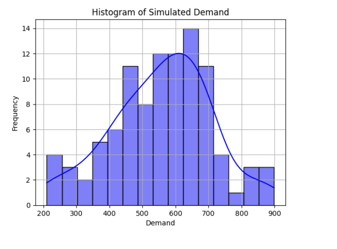
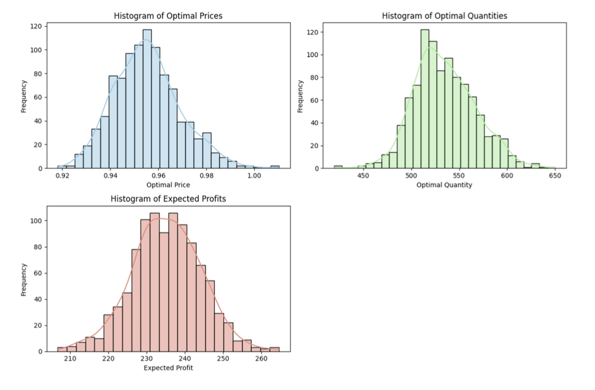
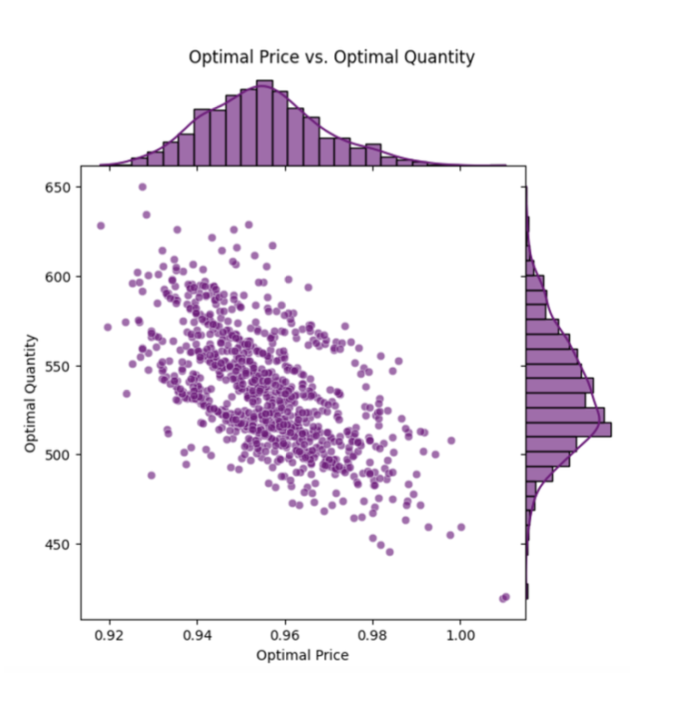

# Newspaper Vendor Model

# Non-Linear Programming: Extended Newsvendor Model

### Project Overview
This project evaluates and compares standard and extended Newsvendor Models (NV) to optimize production quantity and pricing decisions under uncertain demand scenarios. The standard NV model focuses only on quantity, while the extended model includes price sensitivity and real-world costs such as rush and disposal fees, using Quadratically Constrained Programming (QCP).

### Key Objectives
- Optimize production quantity under uncertain demand.
- Incorporate price sensitivity and additional cost factors.
- Evaluate model robustness through sensitivity analysis.

### Methods Used
- Linear Regression for price-demand modeling
- Linear Programming for initial production optimization
- Quadratic Programming (QCP) for simultaneous price and quantity optimization
- Bootstrapping for sensitivity analysis

### Findings
- Optimal price identified at approximately **$0.95**
- Optimal production quantity identified at approximately **535 units**
- Extended model delivered **5–10% higher profits** compared to standard NV model

### Visualizations

### Recommendations
- Implement Quadratically Constrained Programming (QCP) for future pricing and production decisions.
- Regularly update price-demand analytics to ensure accurate demand forecasting.
- Incorporate real-world costs explicitly in decision-making.

---

## Version 2: Compact Summary for Quick Read

# Extended Newsvendor Optimization Project

### Introduction
Comparison of traditional and extended newsvendor models to optimize pricing and production under uncertainty.

### Quick Facts
- **Goal:** Maximize profit through optimal pricing and production quantity
- **Models Compared:**
  - Standard NV (quantity optimization only)
  - Extended NV (price and quantity optimization via Quadratic Programming)

### Results
- **Standard Model:** Quantity = **472 units**, Price = **$1**, Profit = **$231.48**
- **Extended Model:** Quantity = **535 units**, Price = **$0.95**, Profit = **$234.42**
- Profit increase of **5–10%** with extended model

### Sensitivity Analysis
Robustness verified through bootstrapping:
- Stable optimal pricing (~$0.95) and quantity (~535 units)

### Visual Insights

### Strategic Recommendations
- Adopt extended NV model for decision-making.
- Regularly refresh price-demand relationship modeling.
- Integrate comprehensive cost analysis into pricing strategies.

